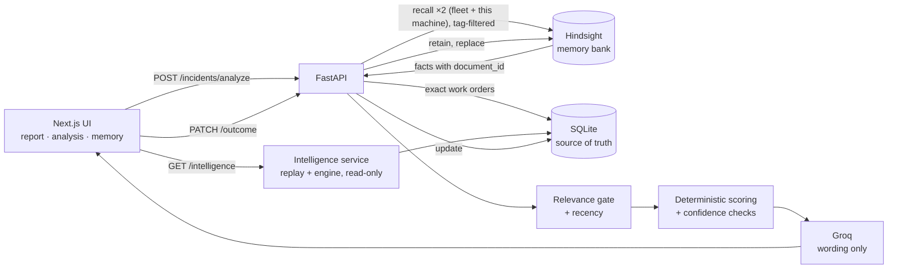

# TRACE — Troubleshooting & Root-Cause Adaptive Context Engine

TRACE helps maintenance technicians fix recurring machine faults by remembering what was tried before on the same kind of problem, and whether it worked.

When a new incident is reported, TRACE recalls similar past work orders from **Hindsight** memory, separates what worked from what failed, scores the interventions deterministically, and only then asks an LLM to put the already-computed result into a readable sentence. When there is no relevant history, it says so and does not suggest an action.

## Table of Contents

- [Pipeline](#pipeline)
- [How Hindsight memory is used](#how-hindsight-memory-is-used)
- [Dataset](#dataset)
- [Hero machines](#hero-machines)
- [TRACE Intelligence](#trace-intelligence)
- [Quick start](#quick-start)
- [Configuration](#configuration)
- [API reference](#api-reference)
- [Frontend](#frontend)
- [Testing](#testing)
- [Verification](#verification)
- [Demo](#demo-1-minute)
- [Limitations](#limitations)

## Pipeline



```
Report incident
  -> Hindsight recall (two passes: fleet of this machine type, and this machine itself)
  -> group recalled memory facts by document_id -> load exact work orders from SQLite
  -> relevance gate      (same defect type, or shared symptom with similarity >= 0.80)
  -> deterministic score (per intervention: successes + 0.5*partials - failures, same-machine weighted)
  -> confidence          (HIGH / MEDIUM / LOW / INSUFFICIENT_DATA from outcome counts)
  -> LLM phrasing        (Groq, wording only; falls back to rule-based text)
Record outcome -> SQLite update -> Hindsight memory replaced -> used by the next similar incident
```

| Concern | Where | Notes |
|---|---|---|
| Source of truth | SQLite (`backend/app/db`) | Every structured field, dashboard stats, machine timelines |
| Memory / retrieval | Hindsight (`backend/app/hindsight`) | One document per incident, `document_id = incident_id` |
| Decision | `backend/app/services/recommendation.py` | Pure Python, no LLM |
| Relevance gate | `backend/app/services/analysis.py` (`select_evidence`) | Deterministic |
| Wording | `backend/app/services/phrasing.py` | Facts-only prompt; rejected if it cites an ID not in the evidence |

Every recommendation also returns the rules behind its confidence (`confidence_checks`: each rule, met or not, with the numbers) and, for every intervention in the evidence, a `verdict` with a deterministic `verdict_reason` ("Never worked: failed 2 of 2 attempt(s)", "Failed more often than it worked (2 vs 1)", "Lower score (1 vs 2)"). The UI renders these as-is, so it never re-implements scoring.

Evidence is also annotated with **recency** (recent < 2 months, older < 8 months, historical), used to rank fleet matches (similarity × recency), and summarised as a **pattern** (how often this problem appears in the evidence, resolved / failed / partial) and **cross-machine evidence** (interventions that worked on ≥ 2 other machines of the type).

Confidence rules: **HIGH** = ≥3 successes and ≥75% success rate (or ≥2 successes on this same machine with none failed there, ≥3 overall, ≥60%); **MEDIUM** = ≥2 successes and ≥50%; **LOW** = any other positive evidence; **INSUFFICIENT_DATA** = no evidence, or nothing has ever worked (no action is suggested).

## How Hindsight memory is used

**Retain.** Every incident becomes one Hindsight document (`MemoryService.build_narrative`) written as a short maintenance record rather than a field dump, for example:

> Maintenance record WO-2026-05416, 2026-06-26 (day shift). CNC-204, 5-axis vertical machining center on Machining Cell 2, 33,814 operating hours. Problem: spindle vibration. … Readings: spindle vibration 8.6 mm/s (normal 0.9-2.4) … Technician T-109 suspected spindle bearing degradation. Intervention (Spindle bearing replacement): Replaced front and rear spindle bearings … Outcome: SUCCESS. Confirmed cause: spindle bearing degradation. Technician notes: Recurring issue: second bearing failure in ~7.5 months …

Each document carries `document_id=<incident_id>`, the incident `timestamp`, metadata (outcome, intervention category), and tags `machine_type:<type>`, `machine:<id>`, `defect:<type>`. When an outcome is recorded, the document is re-retained with `update_mode="replace"`, so memory always reflects the latest known result.

**Recall.** `MemoryService.search_similar_incidents` builds a natural-language query from the new report and runs two `recall()` calls in parallel:

1. tags `[machine_type:<type>]` (`all_strict`): similar incidents across the fleet of this equipment type;
2. tags `[machine_type:<type>, machine:<id>]`: this machine's own history, so a recurring fault is never crowded out by look-alikes on other machines.

Only `world`/`experience` facts are requested because they carry `document_id`. Facts are grouped by document, the best semantic score becomes the incident's similarity, and the exact record is loaded from SQLite. The recalled fact text is shown in the UI under each evidence card ("Recalled from Hindsight memory"), so it is visible that the evidence came from memory rather than a table scan.

In practice recall ranks same-problem work orders at ~0.85–0.93 semantic similarity and unrelated ones at ~0.72–0.79. The relevance gate keeps the former, which is why a novel problem correctly produces no evidence even though recall always returns *something*.

## Dataset

The history is **synthetic but operationally realistic** — it is not data from a real plant. It is generated deterministically (fixed seed) by `backend/app/data/generator.py` from the fleet model in `backend/app/data/catalog.py`:

- **567 work orders**, 2 Jun 2025 – 17 Sep 2026 (~15.5 months), 8–20 per machine
- **5 equipment types, 39 machines with history** (+ AC-407, commissioned 2026-08 with none): CNC machining centers (8), hydraulic presses (7), screw air compressors (6+1), belt conveyors (10), injection molding machines (8)
- **Outcomes:** 47% SUCCESS, 19% PARTIAL, 22% FAILED, 9% UNKNOWN
- Fields: technician ID, operating hours (monotonic per machine), shift, product, sensor readings with normal ranges, suspected vs confirmed cause, intervention category + action text, repair time, downtime, severity, technician notes

How outcomes arise: each defect family has 2–3 possible root causes, each intervention only truly fixes some of them, technicians often suspect the wrong cause or try the cheap fix first, and failed/partial repairs create follow-up work orders days later. So the same intervention succeeds on one machine and fails on another (49 of 71 intervention types have both).

`python -m scripts.audit_data` checks for duplicate IDs, future timestamps, impossible sensor values, downtime shorter than repair time, machine/line mismatches, interventions invalid for the machine type, notes contradicting outcomes, and impossible operating-hour progressions.

## Hero machines

Three showcase machines have scripted chains in the history (`generator.STORIES`) and are listed in `catalog.HERO_MACHINES`:

| Machine | Problem | History on that machine |
|---|---|---|
| **CNC-204** | Spindle vibration | Alignment FAILED → bearing replacement SUCCESS → re-lubrication PARTIAL (7 months later) → bearing replacement SUCCESS |
| **HP-303** | Pressure loss | Relief valve adjustment PARTIAL → pump replacement FAILED → cylinder reseal SUCCESS; a year later reseal FAILED (different cause) → relief valve replacement SUCCESS |
| **CV-507** | Belt mistracking | Tracking adjustment PARTIAL (temporary) → idler replacement SUCCESS |

The **With vs without memory** comparison on TRACE Intelligence (`BeforeAfterMemory.tsx`, `GET /api/dashboard/hero-machines`) runs each hero incident live through the same deterministic scorer twice — once with no evidence, once with Hindsight recall — and shows what trial and error actually cost that machine (attempts that didn't work and their downtime, from SQLite). Nothing in the modal is hardcoded and nothing is stored.

## TRACE Intelligence

The **TRACE Intelligence** page (sidebar) is the visual representation of the factory's accumulated memory: what TRACE has learned, how that knowledge grew, and why its recommendations can be trusted. It is read-only and computed entirely by the backend (`backend/app/services/intelligence.py`) from the SQLite work orders plus the **unchanged** recommendation engine. No LLM is involved and nothing is invented; anything that can't be computed from the data isn't shown.

Two computations do the work:

- **Knowledge per problem**: the engine scores every (equipment type, problem) over all recorded outcomes, giving a fleet-level answer and confidence.
- **Chronological replay**: every work order is compared with what memory held *before* it (earlier outcomes for the same problem and equipment type). Individual recalls aren't logged, so replay is the honest way to measure availability and reuse; the page says so.

| Section | What it shows (all computed) |
|---|---|
| Knowledge overview | Work orders, machines, equipment types, outcomes (worked / partial / failed / unverified), knowledge coverage (problems with a proven fix), knowledge age, and how many problems TRACE answers at each confidence level. A distribution, because averaging HIGH/LOW would be meaningless |
| Memory impact | Without vs with memory, plus the replay result: when the technician's action matched what memory would have recommended, **58%** worked (median downtime 3.1 h) vs **48%** (3.8 h) when a different action was taken. First occurrences (n=26) are shown separately with the caveat that they aren't a like-for-like comparison |
| Knowledge evolution | Month-by-month small multiples: outcomes in memory, problems TRACE can answer (11 → 24 of 25), problems answered with HIGH confidence, share of new work orders that already had memory (57% → 100%) |
| Memory growth | Knowledge before → work order recorded → knowledge after, plus the latest confidence changes. Downgrades after failed or partial repairs are shown too |
| Memory reuse | Share of work orders with earlier evidence (same machine vs fleet-only), repairs memory recommended most often, past work orders cited most as evidence |
| Recommendation trust | Pick any problem: the engine's fleet-level recommendation with the same confidence checklist and verdicts the analysis page uses (reuses `WhyPanel`) |
| Most reliable repairs | Ranked by the 95% Wilson lower bound of the success rate (≥ 5 attempts), with attempts, outcomes and sample strength, so a 2-for-2 fix never outranks 12-for-14. Also lists the least reliable |
| Failure patterns | Most common problems with outcomes and monthly trend, recurring problems per machine, breakdown by equipment type |
| Machine ranking | Machines ranked by problems with a fix proven on that machine, then verified outcomes and success rate; each row expands to per-problem knowledge and links to the machine timeline |
| Knowledge network | Interactive machines → problems → repairs → outcomes graph per equipment type (line width = work orders, ★ = currently recommended), with a text alternative; loaded lazily |

The report is cached on the server and recomputed only when a work order is added or an outcome changes (~100 ms for 567 work orders); the frontend caches it per session and invalidates it after an analysis or recorded outcome.

## Quick start

```bash
# Backend
cd backend
python -m venv venv && source venv/bin/activate
pip install -r requirements.txt
cp .env.example .env            # set HINDSIGHT_API_KEY and GROQ_API_KEY
python seed_data.py             # resets SQLite + the Hindsight bank, loads the history (~1 min)
uvicorn main:app --port 8000 --reload

# Frontend
cd frontend
npm install
cp .env.example .env.local
npm run dev                     # http://localhost:3000
```

`seed_data.py` deletes and recreates the Hindsight bank named in `HINDSIGHT_NAMESPACE` (default `trace-maintenance`). Use your own bank name if you share an account. `python seed_data.py --sqlite` loads SQLite only.

## Configuration

`backend/.env`:

```env
APP_NAME=TRACE
APP_ENV=development
DEBUG=false

# Hindsight (required)
HINDSIGHT_API_URL=https://api.hindsight.vectorize.io
HINDSIGHT_API_KEY=hsk_...
HINDSIGHT_NAMESPACE=trace-maintenance

# LLM phrasing (optional - without a key TRACE uses rule-based wording)
GROQ_API_KEY=gsk_...
LLM_MODEL=openai/gpt-oss-120b
# LLM_BASE_URL=https://api.groq.com/openai/v1
# LLM_TIMEOUT_SECONDS=20

DATABASE_URL=sqlite+aiosqlite:///./trace.db
CORS_ORIGINS=["http://localhost:3000"]
```

`frontend/.env.local`:

```env
NEXT_PUBLIC_API_URL=http://localhost:8000/api
```

## API reference

| Method | Path | Purpose |
|---|---|---|
| POST | `/api/incidents/analyze` | Recall → gate → score → phrase. Returns `current_incident`, `historical_incidents` (with `similarity_score`, `relevance_factors`, `recalled_facts`, `recency_label`, `days_ago`), `successful/failed/partial_interventions`, `recommendation` (`suggested_action`, `intervention_category`, `confidence`, `basis`, `confidence_checks[]`, `evidence[]` tallies with `attempts`, `success_rate`, `verdict`, `verdict_reason`, `warnings`, `reasoning`, `reasoning_source`), `pattern_alert`, `cross_machine_evidence`, `memory_contribution`, `memory_trace` |
| PATCH | `/api/incidents/{id}/outcome` | Record `action_taken`, `intervention_category`, `action_outcome`, root cause, repair time, downtime, notes; updates SQLite and replaces the Hindsight memory |
| GET | `/api/incidents/{id}` | One incident from SQLite |
| GET | `/api/incidents/machine/{machine_id}/memory` | Machine summary: outcome counts, downtime, recurring defects, what worked / failed, full `timeline` |
| GET | `/api/dashboard/stats` | Counts, outcome / defect / machine-type distributions, downtime, history range, memory bank, `memory_growth` (work orders and cumulative outcomes per month) |
| GET | `/api/dashboard/fleet` | Machine types, machines, defect types + symptoms, intervention categories, hero machine per type (drives the forms), `demo_presets` and `demo_outcome` (shared with `scripts/demo.py`) |
| GET | `/api/dashboard/hero-machines` | Live with/without-memory comparison for the hero machines |
| GET | `/api/intelligence` | TRACE Intelligence report: overview, evolution, memory impact, reuse, machines, failure patterns, reliable repairs, knowledge changes, network, per-problem knowledge. Cached until the data changes |
| GET | `/api/intelligence/problem?machine_type=&defect_type=[&machine_id=]` | The engine's recommendation for one problem over all recorded outcomes (optionally weighted for a machine), with confidence checks and verdicts |
| GET | `/api/dashboard/health` | Checks SQLite, the Hindsight bank (with the configured key) and LLM configuration, and reports the last real memory failure (e.g. exhausted credits, which reading the bank config does not reveal); `healthy` or `degraded`, cached 30 s. Drives the sidebar status |

Errors are JSON `{"detail": ...}`: 404 unknown incident, 422 invalid input, 503 when Hindsight is unreachable, with the readable reason extracted from the SDK error (e.g. `Hindsight 402: Insufficient credits…`). Nothing is saved on a 503: a failed memory write rolls the SQLite change back.

Interactive docs: `http://localhost:8000/docs`.

## Frontend

Each page answers one question, shown as its eyebrow and in the sidebar:

| Page | Question | What it shows |
|---|---|---|
| **Dashboard** | What is happening? | Work orders, machines, repairs that worked, downtime logged, outcome mix, most frequent problems, fleet by equipment type |
| **Report Incident** | What happened? | Form built from `/api/dashboard/fleet` (type → machine → problem → symptoms). While analysis runs, a retrieval progress panel names the real pipeline stages |
| **Incident Analysis** | What should I do? | Decision summary (or *recommendation intentionally withheld*), an interactive decision pipeline, why this recommendation (confidence checklist, why each alternative lost, cautions), the AI-written summary in a separate box, what TRACE remembered, and record outcome → *memory grew* |
| **Machine Memory** | What happened before? | Machine picker (grouped by type, filterable), then one machine's stats, full timeline with problem filters and repair-chain markers, what has / hasn't worked |
| **TRACE Intelligence** | What has TRACE learned? | Everything in [TRACE Intelligence](#trace-intelligence), plus **With vs without memory**: a live comparison for the showcase machines |

**Judge mode** (sidebar button, or `?judge=1`) is a presentation layer for a 5-minute demo. A presenter bar walks the story one click per step (arrow keys work too): dashboard → with vs without memory → a new problem → the same problem again → machine history → what TRACE learned. The demo incidents come from the backend catalog. It hides operator/developer controls such as the demo-incident picker, refresh buttons and detailed system status, and adds no data or logic.

**Consistency:** shared primitives in `components/ui.tsx` (`PageHeader`, `Section`, `StatTile`, `LoadingState`, `EmptyState`, `ErrorState`, `ConfidenceMeter`, one card and button style). Loading states say what is happening, empty states say what will appear and how, and errors explain what failed with a retry, never a raw status code.

**Motion:** a short fade between pages, count-up numbers, confidence meters and outcome bars that fill in, staggered timeline entries, and hover elevation on clickable cards. Everything respects `prefers-reduced-motion`.

**Accessibility:** a skip link, one `h1` per page with focus moved to it on navigation, breadcrumbs, `aria-current` in the sidebar, dialog semantics with Esc and focus return for the modal, labelled icon buttons, `aria-expanded` / `aria-pressed`, table captions, text alternatives for every chart, and visible keyboard focus.

The fleet catalog, the with/without-memory comparison and the Intelligence report are cached per page session; heavy visuals load lazily.

## Testing

```bash
cd backend
pytest                      # 73 offline tests, ~2 s: temp SQLite + in-memory Hindsight fake, no LLM
TRACE_LIVE=1 pytest -m live # 4 live tests against the running API with real Hindsight + Groq (~2 min)

cd frontend
npm run typecheck
```

| File | Covers |
|---|---|
| `tests/test_recommendation.py` | Scoring and confidence rules, same-machine rule, downgrade, warnings, no action without evidence, confidence checklist, a reason for every rejected alternative, attempts / success rate |
| `tests/test_insights.py` | Recency bands, recurring-pattern detection, cross-machine evidence |
| `tests/test_intelligence.py` | Wilson ranking, replay uses only earlier outcomes, confidence changes over time, reuse counts, fleet-level trust view, endpoint vs frontend types, cache invalidation, problem endpoint |
| `tests/test_evidence_gate.py` | Relevance gate, same-machine-first ordering, evidence cap |
| `tests/test_phrasing.py` | LLM wording only: fallback on no key / error / empty reply / invented incident ID / no admission of missing evidence |
| `tests/test_dataset.py` | Generator is deterministic, sizes, IDs, timestamps, operating hours, mixed outcomes, hero chains |
| `tests/test_memory.py` | Narrative content, tags, recall grouping, rollback when Hindsight writes fail |
| `tests/test_api.py` | Full HTTP flow (analyze → outcome → recall → machine memory), hero machines, health (including reporting a real memory failure), readable 503 details, memory growth series, demo presets shared with the script, errors (404/422/503), CORS, and a **frontend contract check**: every response is validated against the TypeScript interfaces in `frontend/src/types/incident.ts` |
| `tests/test_live.py` | Health, the 6 validation scenarios, the demo twice from reset, data audit — real services |

## Verification

With the backend running:

```bash
cd backend
python -m scripts.validate_scenarios   # 6 scenarios, real recall + real LLM, cleans up after itself
python -m scripts.demo --runs 3        # before/after-memory demo, reset between runs
python -m scripts.audit_data --recommendations
```

| Scenario | Incident | Expected and observed |
|---|---|---|
| A strong history | CV-505 roller bearing noise | HIGH: idler replacement 7/7 successes, 4 on CV-505 |
| B conflicting | CNC-204 spindle vibration | LOW: bearing replacement 3 of 7 succeeded, 2 failed; CNC-204's own failed alignment shown |
| C sparse | AC-402 oil carryover | LOW: only 2 matches (1 success, 1 partial) |
| D no history | AC-407 condensate drain failure | INSUFFICIENT_DATA, no action suggested |
| E novel | CNC-203 chip conveyor jam | INSUFFICIENT_DATA; recall ran but nothing relevant |
| F recurring | CV-507 belt mistracking | Retrieves CV-507's earlier PARTIAL tracking adjustment and SUCCESS idler replacement |

## Demo (≈1 minute)

See [DEMO.md](DEMO.md) for the full script.

1. `python -m scripts.demo --reset` so AC-407 has no history.
2. Turn on **Judge mode** (sidebar) and use *Next*. Step 2 opens TRACE Intelligence with the live **with vs without memory** comparison for CNC-204 / HP-303 / CV-507, including what trial and error cost each machine.
3. Step 3 loads incident 1 → Analyze. The retrieval panel runs; the result is **Recommendation intentionally withheld**, showing what was searched and why nothing qualified.
4. Record outcome: *Condensate drain replacement*, SUCCESS → **Memory grew 0 → 1**.
5. Step 4 loads incident 2 → Analyze → TRACE recalls incident 1 (tagged *this machine*, *Recent*), recommends it at **LOW** confidence ("1 of 1 recorded attempt worked"), the checklist shows why it is not higher, and the AI summary cites incident 1's ID.
6. Open **AC-407 memory**, or CNC-204 filtered to *Spindle vibration* to show a failed → fixed → came back chain.

## Tech stack

Next.js 14 + TypeScript + Tailwind · FastAPI + SQLAlchemy (SQLite) · Hindsight (`hindsight-client`) · Groq `openai/gpt-oss-120b` via the OpenAI SDK

## Limitations

- Similarity is Hindsight's semantic score; thresholds (0.80 related-problem gate, 15 evidence items) were tuned on this synthetic fleet.
- Intervention categories for new reports come from the catalog list or free text; free-text categories only group with identical text.
- Live reports don't get a severity rating.
- The retrieval progress panel is time-based (the analysis is one request); real per-stage numbers are shown on the analysis page, not while it runs.
- Pattern and cross-machine summaries describe the retrieved evidence (at most 15 incidents), not the machine's full history.
- The demo and validation scripts share AC-407 and reset it; `seed_data.py` rebuilds everything.

## License

MIT
