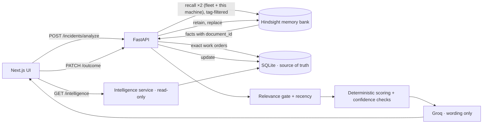

# TRACE — Troubleshooting & Root-Cause Adaptive Context Engine

**TRACE remembers every repair a plant has made and uses that memory to tell the next technician what actually works.**

When a machine fails, TRACE recalls similar past work orders from **[Hindsight](https://hindsight.vectorize.io/)** memory, separates what worked from what failed, scores the options **deterministically**, and only then lets an LLM put the result into words. With no relevant history it says so and recommends nothing. Every outcome a technician records becomes evidence for the next incident.

| | |
|---|---|
| **Live app** | https://trace-frontend-i5gp.onrender.com/ |
| **Live API** | https://trace-api-60le.onrender.com · [Swagger docs](https://trace-api-60le.onrender.com/docs) · [health](https://trace-api-60le.onrender.com/api/dashboard/health) |
| **Stack** | Next.js 14 · FastAPI · SQLite · Hindsight (`hindsight-client`) · Groq `openai/gpt-oss-120b` |
| **Data** | 567 synthetic, operationally realistic work orders · 39 machines · 5 equipment types · 15 months |

> Render's free tier sleeps when idle, so the first request can take 30–60 s while the API wakes up.

**Contents:** [Why](#why-trace) · [How it works](#how-it-works) · [The app](#the-app) · [Hindsight](#how-hindsight-memory-is-used) · [Engine](#recommendation-engine) · [Intelligence](#trace-intelligence) · [Dataset](#dataset) · [Run locally](#run-locally) · [Deployment](#deployment) · [API](#api) · [Testing](#testing) · [Structure](#project-structure)

---

## Why TRACE

In real plants, "what fixed this last time" lives in scattered work orders and in senior technicians' heads. The same fault gets diagnosed from scratch again, cheap but wrong fixes get repeated (re-aligning a spindle whose bearings are failing), and failed attempts are rarely surfaced when the symptom comes back. That trial and error is where the downtime goes.

TRACE turns that history into memory:

- **Remembers.** Each work order is stored as a Hindsight memory and as an exact SQLite record.
- **Learns.** Recording an outcome immediately changes what the next similar incident is told.
- **Explains.** Each recommendation shows the outcomes it came from, why the alternatives lost, and how its confidence was reached.
- **Stays honest.** With no evidence there is no recommendation. Failed repairs count as evidence, and the LLM cannot change the decision.

---

## How it works



1. **Report.** The technician enters the machine, problem, symptoms and a description.
2. **Recall.** Two Hindsight recalls run in parallel: one across the fleet of that equipment type and one over this machine's own history, so a recurring fault is never crowded out. Recall happens *before* the new incident is stored, so it cannot match itself.
3. **Filter.** TRACE keeps past work orders that have a recorded outcome and describe the same problem, or a related one (a shared symptom and similarity ≥ 0.80). This machine's records come first, then the rest by similarity × recency, up to 15.
4. **Score.** Plain Python tallies each intervention and computes confidence (rules below).
5. **Explain.** Groq rewrites the computed result. Its text is rejected if it cites a work order that wasn't retrieved or fails to admit that evidence is missing.
6. **Learn.** The technician records what they did, and TRACE updates SQLite and replaces the Hindsight memory. If the memory write fails, the SQLite change is rolled back and the API returns 503, so the two stores never disagree.

| Concern | Where | Rule |
|---|---|---|
| Source of truth | SQLite (`backend/app/db`) | Every number shown comes from here |
| Memory / retrieval | Hindsight (`backend/app/hindsight`) | One document per work order, `document_id = incident_id` |
| Decision | `services/recommendation.py` | Pure Python, no LLM |
| Relevance gate | `services/analysis.py` → `select_evidence` | Deterministic |
| Wording | `services/phrasing.py` | Facts-only prompt, validated, rule-based fallback |
| Analytics | `services/intelligence.py` | Read-only; reuses the engine unchanged |

---

## The app

The app opens on a **3D landing page** (`public/landing.html`, built with Three.js) that links into the product. Each product page answers one question:

| Page | Question | What you see |
|---|---|---|
| **Dashboard** | What is happening? | Work orders, machines, share of repairs that worked, downtime, outcome mix, most frequent problems, fleet by equipment type |
| **Report Incident** | What happened? | A form built from the backend catalog (type → machine → problem → symptoms), with demo presets. While the analysis runs, a progress panel names each pipeline stage. |
| **Incident Analysis** | What should I do? | The recommendation with a confidence meter showing the real sample ("4 of 7 recorded attempts worked"), or *recommendation intentionally withheld* with what was searched. Also: an interactive decision pipeline, the confidence checklist, why each alternative lost, the AI summary in its own box, evidence grouped by outcome with the text Hindsight recalled, and an outcome form that shows *memory grew* after saving. |
| **Machine Memory** | What happened before? | A machine picker, then that machine's stats and full timeline with problem filters and repair-chain markers (*follow-up*, *came back after a fix*) |
| **TRACE Intelligence** | What has TRACE learned? | The factory's accumulated knowledge ([details](#trace-intelligence)), plus **With vs without memory**: the same incident scored live for three showcase machines |
| **Adaptive Intelligence & ROI** (`?view=sliders`) | What is memory worth? | A before/after split slider (live showcase data), a what-if ROI simulator and a 16-month learning scrubber (see the note below) |

- **Deep links:** `/?view=dashboard|report|memory|intelligence|sliders`, and `/?view=memory&machine=CNC-204` for a specific machine.
- **Design:** a dark navy glass theme and shared page primitives (`components/ui.tsx`). Motion is subtle and respects `prefers-reduced-motion`.
- **Accessibility:** skip link, one `h1` per page, `aria-current`, labelled controls and text alternatives for charts.

> **About the ROI view.** Only the split slider uses live data (`/hero-machines`). The **ROI simulator** is a what-if calculator driven by assumptions you can adjust (fleet size, $/h of downtime, adoption, and so on); it does not measure savings. The **learning scrubber** derives its cards from the slider's month position to illustrate the idea. The measured month-by-month history is in TRACE Intelligence → *Knowledge evolution*.

**Showcase machines.** These are real repair chains in the history, listed in `catalog.HERO_MACHINES`:

| Machine | Problem | What happened |
|---|---|---|
| **CNC-204** | Spindle vibration | Alignment FAILED → bearings SUCCESS → 7 months later, re-lube PARTIAL → bearings SUCCESS |
| **HP-303** | Pressure loss | Relief-valve adjustment PARTIAL → pump FAILED → reseal SUCCESS; a year later, reseal FAILED (a different cause) → relief valve SUCCESS |
| **CV-507** | Belt mistracking | Tracking adjustment PARTIAL (temporary) → idler replacement SUCCESS |

---

## How Hindsight memory is used

**Retain.** Each work order becomes one document, written like a technician's summary (`MemoryService.build_narrative`):

> Maintenance record WO-2026-05416, 2026-06-26 (day shift). CNC-204, 5-axis vertical machining center on Machining Cell 2, 33,814 operating hours. Problem: spindle vibration. … Readings: spindle vibration 8.6 mm/s (normal 0.9-2.4) … Technician T-109 suspected spindle bearing degradation. Intervention (Spindle bearing replacement): Replaced front and rear spindle bearings … Outcome: SUCCESS. …

- The narrative includes only abnormal readings, each with its normal range.
- Each document carries a `document_id`, the incident `timestamp`, metadata (outcome, intervention category) and the tags `machine_type:*`, `machine:*` and `defect:*`.
- Recording an outcome re-retains the document with `update_mode="replace"`.
- Seeding uses `retain_batch`.

**Recall.** TRACE sends a natural-language query ("… What was done before and did it work?") twice in parallel, with `tags_match="all_strict"`: once with `[machine_type]` for the fleet and once with `[machine_type, machine]` for this machine.

- It requests only `world` and `experience` facts, because those carry a `document_id`.
- Facts are grouped per document, and the best semantic score becomes that document's similarity.
- The exact record is then loaded from SQLite.
- The recalled text is shown on each evidence card.

**Why Hindsight rather than SQL search.** Technicians describe the same fault in different words ("chatter marks", "waviness", "spindle noise at high speed"). Semantic recall ranks the most similar contexts among 100+ work orders of the same equipment type and surfaces the machine's own history. SQLite stays authoritative for outcomes and numbers.

In practice, same-problem work orders score about 0.85–0.93 and unrelated ones about 0.72–0.79. The gate keeps the former, so a novel problem correctly gets no evidence.

**Health.** `/api/dashboard/health` checks SQLite, the Hindsight bank and the LLM. It also reports the most recent real memory failure (for example, exhausted credits), with a readable reason taken from the SDK error.

---

## Recommendation engine

Each intervention category in the evidence gets a score:

```
score = successes + 0.5·partials − failures   (+0.5 per success / −0.5 per failure on this machine)
```

UNKNOWN outcomes count as neither success nor failure. The recommended intervention is the best-scoring one that has worked at least once.

| Confidence | Rule |
|---|---|
| **HIGH** | ≥ 3 successes and ≥ 75 % success rate; or ≥ 2 successes on this machine, none failed there, ≥ 3 overall and ≥ 60 % |
| **MEDIUM** | ≥ 2 successes and ≥ 50 % |
| **LOW** | Any other positive evidence |
| **INSUFFICIENT_DATA** | No evidence, or nothing has ever worked → **no action is suggested** |
| Downgrade | One level down if the winner failed on this machine and never worked there |

Every response includes `confidence_checks` (each rule, met or not, with its numbers). For each intervention it also includes `attempts`, `success_rate`, a `verdict` and a `verdict_reason`, such as "Never worked: failed 2 of 2", "Failed more often than it worked (2 vs 1)" or "Lower score (1 vs 2)". The UI displays these as they come.

**Groq's role.** Groq receives only the computed facts: the decision, per-intervention tallies with their work-order IDs, this machine's recent outcomes and the warnings. It is told to use nothing else. TRACE discards its text and keeps the deterministic wording if:

- the call fails or the reply is empty,
- the reply cites an ID that isn't in the evidence, or
- there is no evidence and the reply doesn't say so.

`reasoning_source` tells the UI which wording is shown.

**Extra context on each analysis:**

- **Recency** of each piece of evidence: recent (< 2 months), older (< 8 months) or historical.
- **Pattern** summary: how often this problem appears in the evidence.
- **Cross-machine** evidence: fixes that worked on at least 2 other machines of the same type.

---

## TRACE Intelligence

A read-only page computed by `services/intelligence.py` from SQLite and the unchanged engine. It uses no LLM and invents nothing. Two computations drive it:

- **Knowledge per problem:** the engine run over all recorded outcomes.
- **Chronological replay:** what memory held *before* each work order. Actual recalls aren't logged, and the page says so.

| Section | Shows |
|---|---|
| Knowledge overview | Work orders, machines, outcomes, coverage (24 of 25 known problems have a proven fix), knowledge age, and how many problems TRACE answers at each confidence level |
| Memory impact | In the replay, attempts that matched memory's recommendation worked **58 %** of the time (median downtime 3.1 h), versus **48 %** (3.8 h) for a different action. First occurrences (n = 26) are shown separately with a caveat. |
| Knowledge evolution | Month by month: outcomes in memory, problems TRACE can answer (11 → 24), problems at HIGH confidence, and the share of new work orders that already had memory (57 % → 100 %) |
| Memory growth | Before → work order recorded → after, and the latest confidence changes, including downgrades |
| Memory reuse | Work orders with earlier evidence (same machine vs fleet only), most-recommended repairs and most-cited past work orders |
| Recommendation trust | The fleet-level recommendation for any problem, with the same checklist and verdicts as the analysis page |
| Reliable repairs | Ranked by the 95 % Wilson lower bound (≥ 5 attempts), so 2 for 2 never outranks 12 for 14; the least reliable repairs are listed too |
| Failure patterns | Most common problems with their trend, recurring problems per machine, and per equipment type |
| Machine ranking | Machines ranked by problems with a fix proven on that machine, then by verified outcomes; each row expands to per-problem knowledge |
| Knowledge network | Machines → problems → repairs → outcomes for each equipment type (lazy-loaded, with a text alternative) |

The report takes about 100 ms to compute. The server caches it until the work orders change, and the browser caches it for the session.

---

## Dataset

The data is synthetic but operationally realistic. `backend/app/data/generator.py` generates it deterministically (fixed seed) from the fleet model in `catalog.py`:

- **567 work orders** from Jun 2025 to Sep 2026, 8–20 per machine.
- **39 machines:** CNC machining centers (8), hydraulic presses (7), screw air compressors (6, plus AC-407 with no history), belt conveyors (10) and injection molding machines (8).
- **Outcomes:** 47 % SUCCESS · 20 % PARTIAL · 23 % FAILED · 10 % UNKNOWN. 49 of the 71 intervention types have both succeeded and failed somewhere.
- **Each record** has a technician, operating hours (always increasing), shift, product, sensor readings, suspected vs confirmed cause, intervention category and action, repair time, downtime, severity and notes.
- **Outcomes come from a model, not random labels.** Each problem has 2–3 possible causes and each fix only works for some of them. Technicians often suspect the wrong cause or try the cheap fix first, and failed or partial repairs create follow-up work orders days later.

`python -m scripts.audit_data` checks for duplicates and validates timestamps, sensor bounds, downtime vs repair time, fleet consistency, notes vs outcomes and the progression of operating hours.

---

## Run locally

You need Python 3.11+, Node 18+, a [Hindsight](https://ui.hindsight.vectorize.io) API key with credits, and optionally a [Groq](https://console.groq.com) key.

```bash
# Backend
cd backend
python -m venv venv && source venv/bin/activate
pip install -r requirements.txt
cp .env.example .env                 # set HINDSIGHT_API_KEY, GROQ_API_KEY
python seed_data.py                  # rebuilds SQLite and the Hindsight bank (~1 min)
uvicorn main:app --port 8000 --reload

# Frontend (second terminal)
cd frontend
npm install
cp .env.example .env.local           # NEXT_PUBLIC_API_URL=http://localhost:8000/api
npm run dev                          # http://localhost:3000
```

<details>
<summary><b>Environment variables</b></summary>

| Variable | Default | Purpose |
|---|---|---|
| `HINDSIGHT_API_URL` | `https://api.hindsight.vectorize.io` | Hindsight endpoint |
| `HINDSIGHT_API_KEY` | — | Required |
| `HINDSIGHT_NAMESPACE` | `trace-maintenance` | Bank name. **`seed_data.py` deletes and recreates this bank**, so use your own if you share a Hindsight account |
| `GROQ_API_KEY` | — | Optional; without it TRACE uses rule-based wording |
| `LLM_MODEL` / `LLM_BASE_URL` / `LLM_TIMEOUT_SECONDS` | `openai/gpt-oss-120b` / Groq / `20` | LLM phrasing |
| `DATABASE_URL` | `sqlite+aiosqlite:///./trace.db` | SQLite file |
| `CORS_ORIGINS` | `["http://localhost:3000", "http://127.0.0.1:3000"]` | Allowed frontend origins |
| `NEXT_PUBLIC_API_URL` (frontend) | `http://localhost:8000/api` | Backend URL |

`python seed_data.py --sqlite` loads SQLite only, with no Hindsight calls.
</details>

**Demo:** see [DEMO.md](DEMO.md). Reset the demo machine first with `python -m scripts.demo --reset`.

---

## Deployment

Both services run on **Render**, defined by the blueprint in [`render.yaml`](render.yaml):

| Service | URL | Build / start |
|---|---|---|
| `trace-api` (Python 3.11) | https://trace-api-60le.onrender.com | `pip install -r requirements.txt` · `bash start.sh` |
| `trace-frontend` (Node 20) | https://trace-frontend-i5gp.onrender.com | `npm install && npm run build` · `npm start` |

- `backend/start.sh` creates the tables, runs `seed_data.py` only when the database is empty, then starts uvicorn.
- The deployed API uses the Hindsight bank **`trace-manufacturing`**. `HINDSIGHT_API_KEY` and `GROQ_API_KEY` are stored as Render secrets.
- The free tier's filesystem is ephemeral. After a redeploy the SQLite file is empty, so the start script reseeds, which also recreates the Hindsight bank.

---

## API

All paths are under `/api`. Errors are JSON `{"detail": …}`: 404 for an unknown incident, 422 for invalid input, and 503 when memory is unavailable (in which case nothing is saved).

| Method | Path | Purpose |
|---|---|---|
| POST | `/incidents/analyze` | Recall → gate → score → phrase; stores the incident |
| PATCH | `/incidents/{id}/outcome` | Records the outcome; updates SQLite and replaces the memory |
| GET | `/incidents/{id}` | One work order |
| GET | `/incidents/machine/{machine_id}/memory` | Machine summary and full timeline |
| GET | `/dashboard/stats` | Fleet counts, distributions, downtime, history range, monthly growth |
| GET | `/dashboard/fleet` | Catalog for the forms, showcase machine per type, demo presets |
| GET | `/dashboard/hero-machines` | Live with/without-memory comparison (dry run, no LLM) |
| GET | `/dashboard/health` | SQLite, Hindsight and LLM status (cached 30 s) |
| GET | `/intelligence` | TRACE Intelligence report (cached until the data changes) |
| GET | `/intelligence/problem?machine_type=&defect_type=[&machine_id=]` | Engine recommendation for one problem over all outcomes |

<details>
<summary><b>Key response fields</b></summary>

- **`AnalysisResult`**:
  - `current_incident`
  - `historical_incidents[]`: `incident`, `similarity_score`, `relevance_factors`, `recalled_facts`, `recency_label`, `days_ago`
  - `successful_interventions[]`, `failed_interventions[]`, `partial_interventions[]`
  - `recommendation`: `suggested_action`, `intervention_category`, `confidence`, `basis`, `confidence_checks[]`, `evidence[]` (with `attempts`, `success_rate`, `verdict`, `verdict_reason`), `warnings`, `reasoning`, `reasoning_source`
  - `pattern_alert`, `cross_machine_evidence`, `memory_contribution`, `memory_trace`
- **`IncidentUpdate`** (PATCH body): `action_taken` (required), `action_outcome` (`SUCCESS|PARTIAL|FAILED|UNKNOWN`), `intervention_category`, `confirmed_root_cause`, `resolution_details`, `resolution_time_minutes`, `downtime_minutes`, `technician_notes`
- **Health**: `status` (`healthy|degraded`), `checks.sqlite`, `checks.hindsight` (with the last failure reason), `checks.llm`

The TypeScript mirror of every response is `frontend/src/types/incident.ts`, and a backend test checks live responses against it.
</details>

---

## Testing

```bash
cd backend
pytest                        # 73 offline tests (~2 s): temp SQLite + in-memory Hindsight fake, no LLM
TRACE_LIVE=1 pytest -m live   # 4 live tests against the running API with real Hindsight + Groq
cd ../frontend && npm run typecheck
```

<details>
<summary><b>What the tests cover</b></summary>

| File | Covers |
|---|---|
| `test_recommendation.py` | Scoring, confidence rules, same-machine rule, downgrade, warnings, checklist, a reason for every rejected alternative |
| `test_evidence_gate.py` | Relevance gate, ordering, cap, recency with naive timestamps |
| `test_insights.py` | Recency bands, pattern detection, cross-machine evidence |
| `test_phrasing.py` | LLM fallbacks: no key, error, empty reply, invented ID, no admission of missing evidence |
| `test_dataset.py` | Deterministic generator, sizes, IDs, timestamps, hours, mixed outcomes, showcase chains |
| `test_memory.py` | Narrative, tags, recall grouping, rollback when Hindsight writes fail |
| `test_intelligence.py` | Wilson ranking, replay, confidence changes, reuse, trust view, caching, contract |
| `test_api.py` | Full HTTP loop, showcase machines, health, readable 503s, growth, demo presets, 404/422, CORS, **frontend contract check** |
| `test_live.py` | Health, six validation scenarios, demo twice from reset, data audit — against real services |
</details>

**Scripts** (`backend/scripts/`):

- `validate_scenarios.py` runs six scenarios: strong, conflicting, sparse, no history, novel and recurring. All pass.
- `demo.py --runs 3` runs the scripted memory loop, with reset.
- `audit_data.py [--recommendations]` audits the dataset.

---

## Project structure

```
trace-engine/
├── render.yaml                  Render blueprint (API + frontend)
├── DEMO.md                      Presentation script
├── docs/TRACE_PROJECT_REVIEW.md Technical review brief
├── backend/
│   ├── main.py                  FastAPI app, CORS, error handlers
│   ├── start.sh                 Deploy start: seed if empty, then serve
│   ├── seed_data.py             Rebuild SQLite + Hindsight bank
│   ├── app/api/                 incidents, dashboard, intelligence routers
│   ├── app/services/            analysis (pipeline + gate), recommendation, phrasing, intelligence
│   ├── app/hindsight/           SDK client, memory service (narratives, recall, rollback)
│   ├── app/db/                  SQLAlchemy engine, table, repository
│   ├── app/data/                fleet catalog, deterministic generator
│   ├── app/models/              Pydantic schemas
│   ├── scripts/                 validation, demo, audit
│   └── tests/                   pytest suite (+ Hindsight fake, TS contract reader)
└── frontend/
    ├── public/landing.html      3D landing page (Three.js)
    └── src/
        ├── app/page.tsx         View routing (?view=…), landing iframe
        ├── components/          Dashboard, ReportIncident, IncidentAnalysis, MachineMemory, SliderDashboard, Sidebar, ui.tsx
        ├── components/analysis/ Decision summary, pipeline, why panel, evidence, outcome form, progress
        ├── components/intelligence/ TRACE Intelligence sections and charts
        ├── lib/                 API client (cached), formatting utils
        └── types/incident.ts    TypeScript mirror of the API
```

---

## License

MIT
